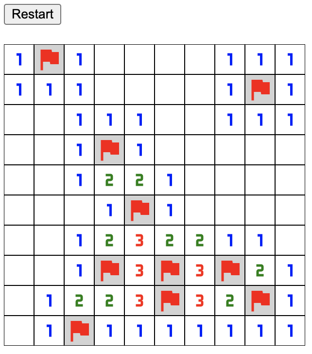

# Django + HTMX Minesweeper

**🚧 Work in Progress 🚧**

Minesweeper implementation using Django and HTMX

## Mouse Actions 

- Click: Reveal
- Right-click: Mark/Unmark (flag)

## Author

- [Ronie Martinez](mailto:ronmarti18@gmail.com)

## Attribution

- Icons from https://pictogrammers.com/library/mdi/
